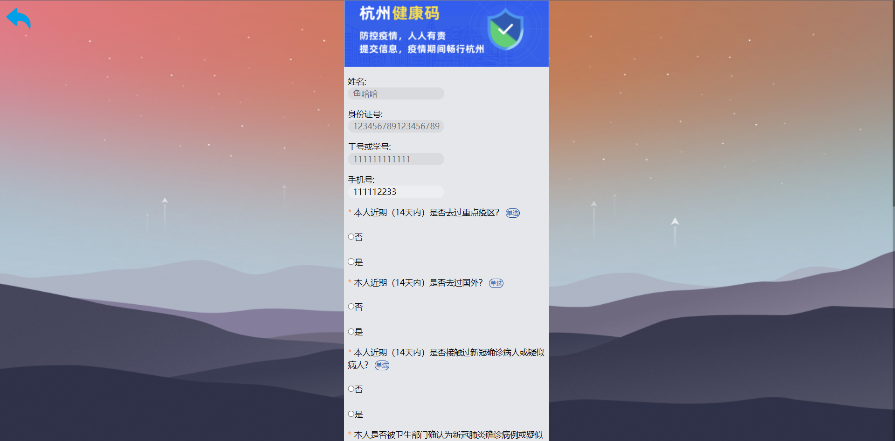

# health_system

本项目是师生健康管理系统，分为管理员和用户两个模块。管理员模块拥有登录，权限管理，对用户信息的增删改查等操作；用户模块拥有登录，健康打卡，查看健康码等操作。

## 系统概览

### 用户登录页面

### 管理员登录页面

### 用户主页面

### 健康码页面

### 健康打卡页面

### 管理员信息管理页面

### 新增用户对话框页面

### 修改对话框页面

### 管理员列表页面

### 概览页面

### 导入页面

